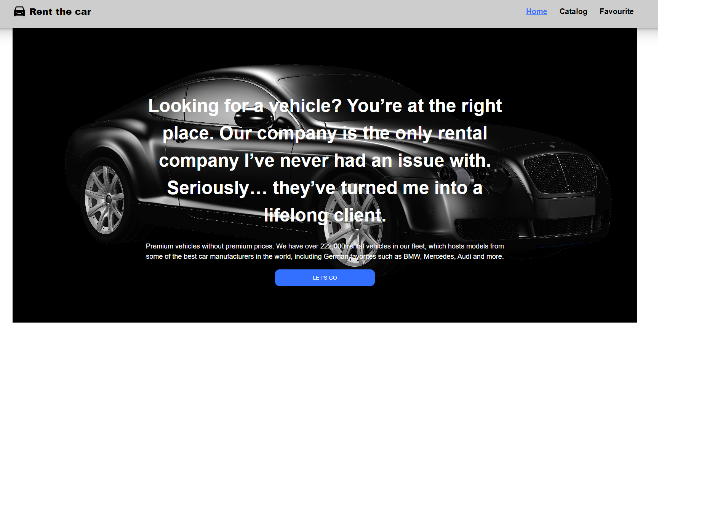
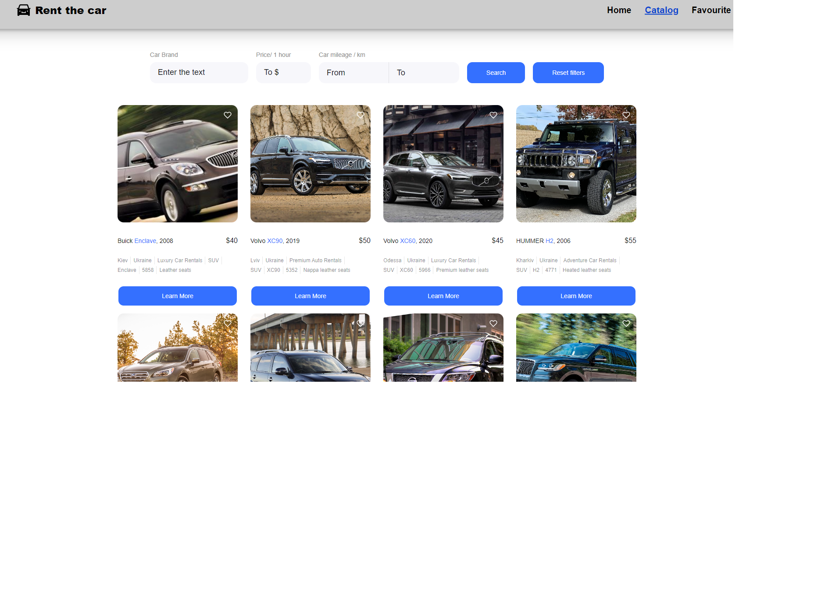
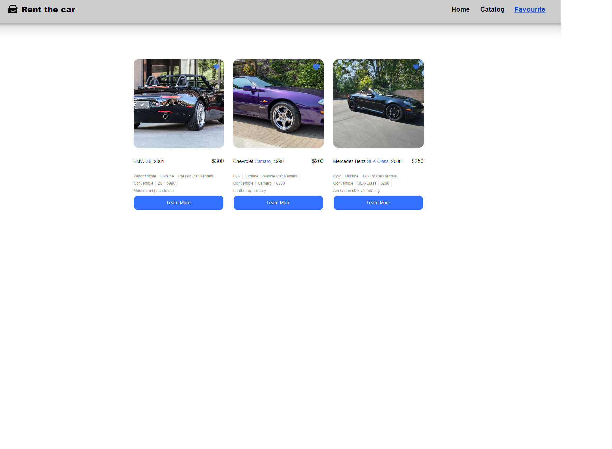

## Rent Car

"Rent Car" rental car application is developed as a test application for car
rental in Ukraine. [Site on Github Page](https://github.com/bajmutov/Rent-Car).

## Features

- **Search and Filter:** Find the perfect car for your needs by searching and
  applying filters such as model, make, and rental price.

- **Booking System:** Reserve your desired car with our straightforward booking
  system. Receive confirmation and details via email.

- **Favorites:** Store your most desired cars in on place - personal page, where
  you can save different cars depending on the situation.

## Views

# Home

the welcoming home page displays main features and innovations.

# Catalog

the main functional page, where you can select the car you are interested in,
both for rent and for the wish list.

# Favorites

displays selected cars in the wish list You can remove an item by clicking on
the "heart".v

## Technologies Used

- Frontend: HTML, CSS, JS, React, Redux, React-Router, Redux-Toolkit
- Backend: Mockapi.io

## Getting Started

1. Clone the repository:
   `git clone https://github.com/your-username/car-rental-web-app.git`
2. Navigate to the project directory: `cd car-rental-web-app`
3. Install dependencies: `npm install`
4. Set up environment variables (refer to `.env.example` for required
   variables).
5. Run the application: `npm start`
